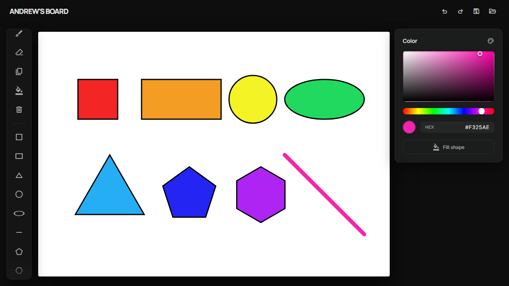
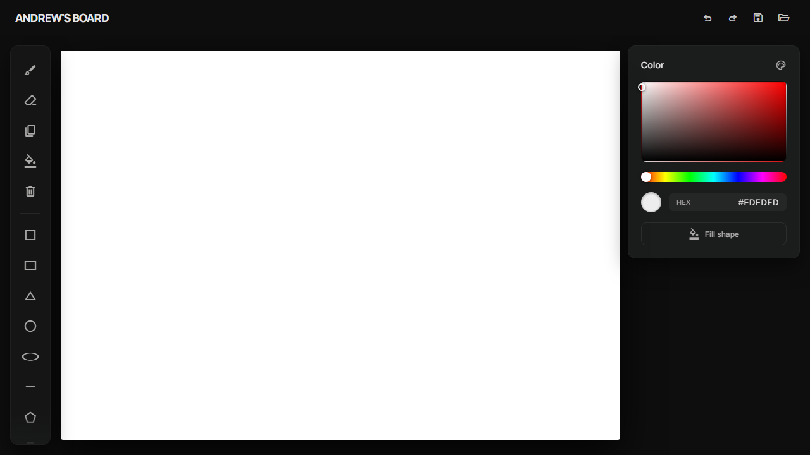
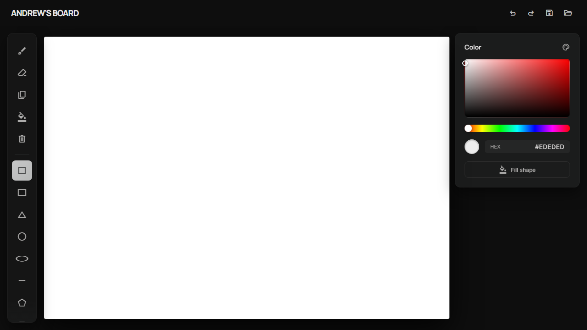
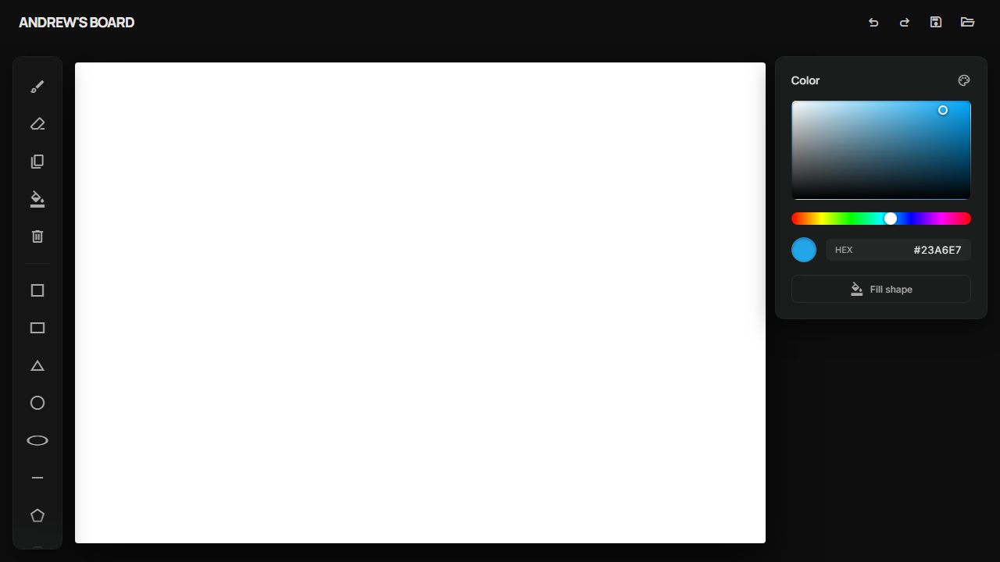
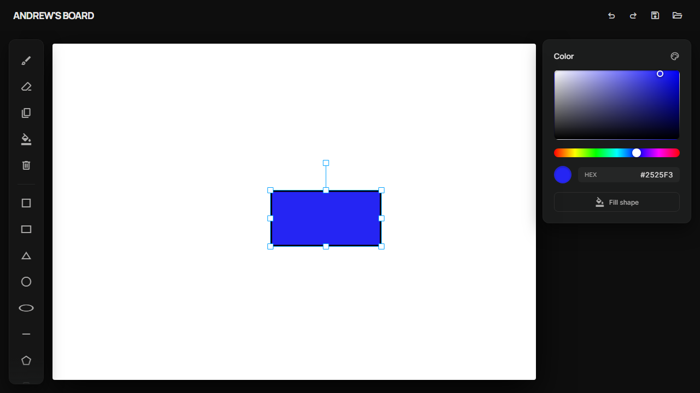
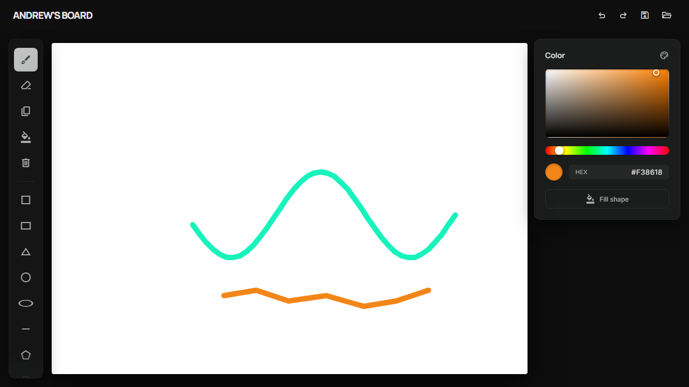

# Andrew's Board

A web-based paint application — draw shapes, sketch freehand, transform, undo, save, and load — built as a Vue 3 single-page app on top of a Spring Boot REST backend.



## Purpose

The project is a full-stack vector drawing app that demonstrates:

- A reactive Vue 3 / TypeScript frontend rendering on an HTML canvas via [Konva](https://konvajs.org/) (vue-konva).
- A stateful Spring Boot backend that owns the source of truth for shapes, the undo / redo history, and serialization to disk.
- A clean REST contract between the two so every user action — create, move, resize, recolor, clone, delete — is mirrored to the server immediately.

It is meant as a showcase project: the kind of app a designer would prototype interactions in, while a developer can read end-to-end how a thin client talks to a stateful service.

## Features

| | |
| --- | --- |
| **8 shapes** | Square, Rectangle, Circle, Ellipse, Triangle, Pentagon, Hexagon, Line |
| **Freehand brush** | Mouse-driven smooth stroke (Konva `Line` with `lineCap: round`) |
| **HSV color picker** | Saturation/value gradient + hue slider, with live hex readout |
| **Fill toggle** | Apply the active color to any existing shape with one click |
| **Eraser** | Click any shape to delete it |
| **Copy** | Click a shape to clone it server-side |
| **Drag & transform** | Move and resize via Konva's `Transformer` (handles + rotation) |
| **Undo / redo** | Full history kept on the backend; the canvas re-syncs on every step |
| **Clear all** | Wipe the canvas in one click |
| **Save / Load** | Native file picker, JSON or XML, format chosen by extension |
| **Toast errors** | Inline failure notifications for save / load |

## Screenshots

| Empty canvas | Shape tool active |
| --- | --- |
|  |  |

| HSV color picker | Selection + transformer |
| --- | --- |
|  |  |

| Brush strokes | All shapes |
| --- | --- |
|  |  |

## Architecture

```
┌────────────────────────────┐        REST        ┌──────────────────────────┐
│  Vue 3 SPA (port 8080)     │  ───────────────▶  │  Spring Boot (port 8081) │
│  vue-konva canvas          │                    │  PaintService singleton  │
│  HSV color panel           │  ◀───────────────  │  undo / redo stacks      │
│  Toolbar + sidebars        │   shape arrays     │  XML / JSON save / load  │
└────────────────────────────┘                    └──────────────────────────┘
```

## Running locally

Both services must be running simultaneously.

### Backend (port 8081)

```bash
cd backend
./mvnw spring-boot:run
```

### Frontend (port 8080)

```bash
cd frontend
npm install
npm run dev
```

Open `http://localhost:8080`.

## Tests

Unit tests live alongside the code under `__tests__/` directories on the frontend and `src/test/java` on the backend.

```bash
# Frontend (Vitest)
cd frontend
npm run test:unit

# Backend (JUnit / Maven)
cd backend
./mvnw test
```

## Screenshot pipeline (Playwright)

The screenshots above are reproducible: a Playwright spec drives the live UI and writes PNGs to `docs/screenshots/`.

```bash
cd frontend
npm install                # one-time
npx playwright install chromium

# both servers must already be running on 8080 / 8081
npm run screenshots
```